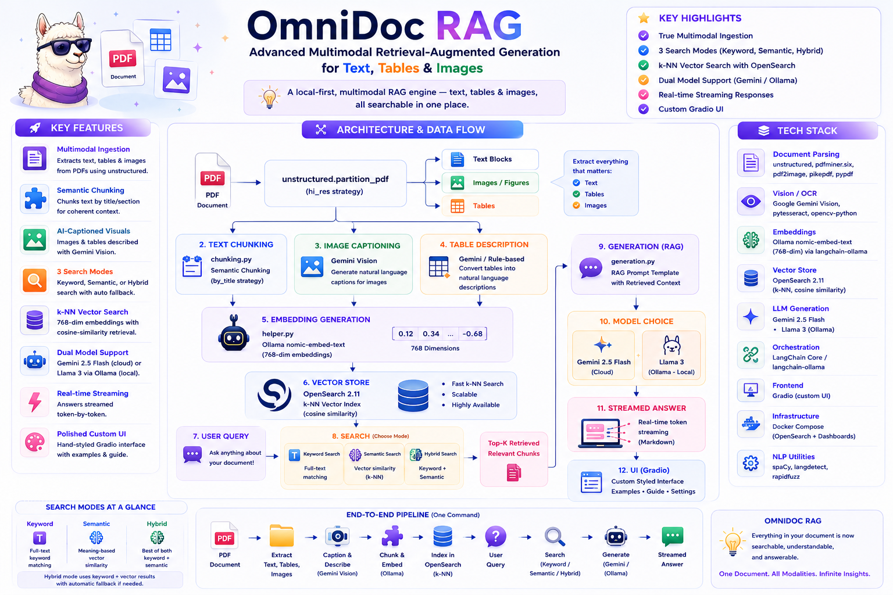

# 📄 From Raw Documents to Searchable Vectors



Part of the [**Hands-On-RAG-Full**](https://github.com/paras160500/Hands-On-RAG-Full) series. This module covers the **document ingestion and representation pipeline** — everything that happens before retrieval: parsing documents of different formats, extracting structured and unstructured content, turning text into embeddings, persisting those embeddings in a lightweight vector store, and generating context-grounded answers with a local LLM.

---

## 🚀 What's Covered

| Notebook / File | Topic | Key Tools |
|---|---|---|
| [`parse_pdf.ipynb`](#1-pdf-parsing--pymupdf) | Extract text, text blocks, tables, and images from PDFs | `PyMuPDF` (`fitz`) |
| [`parse_docx.ipynb`](#2-docx-parsing--python-docx) | Extract paragraphs, tables, and embedded images from Word documents | `python-docx`, `zipfile` |
| [`parse_in_llm.ipynb`](#3-llm-powered-document-parsing--openai) | Upload a PDF to the OpenAI Files API and use `gpt-5.1` to extract text, tables, and images via prompting | `openai`, `PyMuPDF` |
| [`embedding.ipynb`](#4-text-embeddings--sentence-transformers) | Encode sentences into dense vectors, compute cosine similarity, and visualise the similarity matrix as a heatmap | `sentence-transformers`, `matplotlib` |
| [`sqlite_vec.ipynb`](#5-vector-storage-with-sqlite-vec) | Store embeddings in a SQLite virtual table and run nearest-neighbour search | `sqlite-vec`, `sentence-transformers` |
| [`generative_llms.ipynb`](#6-context-grounded-generation--ollama) | Use a local LLaMA 3 model to answer questions strictly from a provided context, demonstrating the "generation" half of RAG | `ollama` |
| [`spacy_sentencizer.py`](#7-sentence-boundary-detection--spacy) | A standalone demo of NLP-aware sentence splitting for accurate text chunking | `spaCy` |

---

## 🏗️ Pipeline Overview

```
Raw Document (PDF / DOCX / ODT)
         │
         ▼
  ┌──────────────────────────────────────┐
  │ Parsing Layer                        │
  │  ├── PyMuPDF  →  text / blocks /     │
  │  │              tables / images      │
  │  ├── python-docx → paragraphs /      │
  │  │                 tables / images   │
  │  └── OpenAI Files API → LLM parsing  │
  └──────────────────────────────────────┘
         │
         ▼
  ┌──────────────────────────────────────┐
  │ Chunking Layer                       │
  │  └── spaCy sentencizer               │
  │      (sentence-boundary-aware split) │
  └──────────────────────────────────────┘
         │
         ▼
  ┌──────────────────────────────────────┐
  │ Embedding Layer                      │
  │  └── SentenceTransformer             │
  │      all-MiniLM-L6-v2 (384-dim)      │
  └──────────────────────────────────────┘
         │
         ▼
  ┌──────────────────────────────────────┐
  │ Vector Store                         │
  │  └── SQLite + sqlite-vec             │
  │      (cosine nearest-neighbour)      │
  └──────────────────────────────────────┘
         │
         ▼
  ┌──────────────────────────────────────┐
  │ Generation Layer                     │
  │  └── LLaMA 3 via Ollama              │
  │      (context-grounded answering)    │
  └──────────────────────────────────────┘
```

---

## 📦 Installation

```bash
pip install pymupdf pandas python-docx openai python-dotenv
pip install sentence-transformers matplotlib
pip install sqlite-vec
pip install ollama
pip install spacy
python -m spacy download en_core_web_sm
```

### 🧠 Install Ollama (local LLM)

Download from [ollama.com](https://ollama.com), then pull the model used in the notebook:

```bash
ollama pull llama3:latest
```

### 🔑 Environment Variables

Create a `.env` file in this folder with:

```env
OPEN_AI_API=your_openai_api_key
```

> `OPEN_AI_API` is only required for `parse_in_llm.ipynb`. All other notebooks run without an API key.

---

## 🧪 How It Works

### 1. PDF Parsing — PyMuPDF

`parse_pdf.ipynb` demonstrates four levels of PDF extraction with `PyMuPDF`:

**Full-page text:**
```python
with pymupdf.open("Sample/sample_data.pdf") as doc:
    for page in doc:
        text = page.get_text()
```

**Structural text blocks** (each block is a paragraph-level chunk):
```python
        text = page.get_text("blocks")
        for block in text:
            print(block[4])      # block[4] = the text content
```

**Tables** (detected automatically, extracted as 2D lists):
```python
        tables = page.find_tables()
        for table in tables:
            print(table.extract())
```

**Unstructured text only** (tables excluded via bounding-box filtering):
```python
def extract_unstructured_text(pdf_path):
    """Extract unstructured text from PDF, excluding table content."""
    with pymupdf.open(pdf_path) as doc:
        for page in doc:
            tables = page.find_tables()
            # filter out blocks overlapping with table bounding boxes
            ...
```

**Embedded images** (extracted and saved to disk):
```python
        image_list = page.get_images()
        for img in image_list:
            xref = img[0]
            base_image = doc.extract_image(xref)
            image_bytes = base_image['image']
```

---

### 2. DOCX Parsing — python-docx

`parse_docx.ipynb` covers three extraction modes for Word documents:

**Paragraphs and tables** via `python-docx`:
```python
document = Document("Sample/sample_data.docx")

for para in document.paragraphs:
    if len(para.text.strip()) > 0:
        print(para.text)

for table in document.tables:
    for row in table.rows:
        row_text = [cell.text for cell in row.cells]
        print(row_text)
```

**Embedded images** via `zipfile` (a `.docx` is a ZIP archive — images live inside `word/media/`):
```python
zipf = zipfile.ZipFile('Sample/sample_data.docx')
for fname in zipf.namelist():
    _, ext = os.path.splitext(fname)
    if ext in ['.jpg', '.jpeg', '.png', '.gif']:
        with zipf.open(fname) as img_file:
            display(Image(data=img_file.read()))
```

---

### 3. LLM-Powered Document Parsing — OpenAI

`parse_in_llm.ipynb` uses the OpenAI Files API to upload the PDF once, then extracts each content type via separate prompts to `gpt-5.1`:

```python
file = client.files.create(
    file=open("Sample/sample_data.pdf", "rb"),
    purpose="user_data"
)
```

**Text extraction:**
```python
completion = client.chat.completions.create(
    model="gpt-5.1",
    messages=[{
        "role": "user",
        "content": [
            {"type": "file", "file": {"file_id": file.id}},
            {"type": "text", "text": "Extract the text content from the file. Exclude text from tables or images."}
        ]
    }]
)
```

**Table extraction** (returned as Markdown tables), **image extraction** (returned as base64), and a hybrid approach that uses PyMuPDF to extract the raw image bytes then base64-encodes them locally are all shown.

---

### 4. Text Embeddings — Sentence Transformers

`embedding.ipynb` builds intuition for what embeddings are and how cosine similarity works:

```python
model = SentenceTransformer("all-MiniLM-L6-v2")

sentences = [
    "I am a happy person.",
    "I am a joyful person.",
    "I am a pessimistic person.",
    "I am not an optimistic person."
]

embeddings = model.encode(sentences)
print(embeddings.shape)        # (4, 384)

similarity_matrix = model.similarity(embeddings, embeddings)
```

The similarity matrix is visualised as a colour-coded heatmap — "happy" and "joyful" cluster together (high similarity), while "pessimistic" and "not optimistic" are similar to each other but distant from the positive pair.

---

### 5. Vector Storage with sqlite-vec

`sqlite_vec.ipynb` shows how to persist embeddings in a lightweight, zero-dependency vector store using SQLite + the `sqlite-vec` extension:

```python
sqlite_db = sqlite3.connect("embeddings.db")
sqlite_db.enable_load_extension(True)
sqlite_vec.load(sqlite_db)
sqlite_db.enable_load_extension(False)

sqlite_db.execute(f"""
    CREATE VIRTUAL TABLE chunks USING vec0(
        chunk_id INTEGER PRIMARY KEY,
        text TEXT,
        embedding float[{embedding_dimension}]
    )
""")
```

Embeddings are serialised to raw bytes before insertion:
```python
def serialize_f32(vector: List[float]) -> bytes:
    return struct.pack("%sf" % len(vector), *vector)

sqlite_db.execute(
    "INSERT INTO chunks (chunk_id, text, embedding) VALUES (?,?,?)",
    (i, text, serialize_f32(embedding))
)
```

Nearest-neighbour search uses SQLite's `MATCH` syntax:
```python
query = "I am a glad person."
query_embedding = model.encode(query, normalize_embeddings=True)

cursor = sqlite_db.execute(f"""
    SELECT chunk_id, text, distance
    FROM chunks
    WHERE embedding MATCH '{query_embedding.tolist()}'
    ORDER BY distance
    LIMIT 1
""")
```

The notebook runs two queries — *"I am a glad person"* (should match "joyful/happy") and *"I am a negative person"* (should match "pessimistic/not optimistic") — to verify the vector store retrieves semantically correct results.

---

### 6. Context-Grounded Generation — Ollama

`generative_llms.ipynb` demonstrates the generation half of RAG using a local LLaMA 3 model:

```python
import ollama
model = "llama3:latest"

response = ollama.chat(
    model=model,
    messages=[
        {"role": "user", "content": prompt_template.format(query=query, context=context)}
    ]
)
print(response.message.content)
```

Three different queries are posed against the same context paragraph (about LLM-as-a-judge evaluation), showing how the model answers differently depending on whether the answer exists in context and how the question is phrased.

---

### 7. Sentence Boundary Detection — spaCy

`spacy_sentencizer.py` demonstrates why NLP-aware chunking matters over naive splitting on `.` — abbreviations like `Mr.` and `A.I.` don't end sentences:

```python
nlp = spacy.load("en_core_web_sm")
text = "Mr. Alex is a teacher. He teaches A.I. (?). Does he love his work? Of course!"
doc = nlp(text)

for sent in doc.sents:
    print(sent.text)
# → 'Mr. Alex is a teacher.'
# → 'He teaches A.I. (?).'
# → 'Does he love his work?'
# → 'Of course!'
```

---

## 📁 Sample Data

The `Sample/` folder contains a single document in three formats — `sample_data.pdf`, `sample_data.docx`, `sample_data.odt` — used as the shared input across all parsing notebooks. The document includes paragraphs, tables, and embedded images to exercise every extraction path.

---

## ⚡ Tech Stack

| Layer | Tool |
|---|---|
| PDF parsing | `PyMuPDF` (`fitz`) |
| DOCX parsing | `python-docx`, `zipfile` |
| LLM-based parsing | OpenAI Files API (`gpt-5.1`) |
| Sentence segmentation | `spaCy` (`en_core_web_sm`) |
| Embeddings | `sentence-transformers` (`all-MiniLM-L6-v2`, 384-dim) |
| Vector store | `SQLite` + `sqlite-vec` |
| Generation | `Ollama` (`llama3:latest`) |
| Visualisation | `matplotlib` |

---

## 🧠 Key Learnings

- PDF, DOCX, and ODT files store content very differently under the hood — the right parser depends on the format, and naive text extraction loses structural signals (tables, headings, images) that matter for retrieval quality.
- **LLM-based parsing** (`parse_in_llm.ipynb`) can handle messy, complex layouts without hand-crafting extraction rules — at the cost of API latency and spend.
- Embeddings don't just encode meaning — they encode **semantic direction**: "not optimistic" and "pessimistic" are closer to each other than either is to "happy", even though all three are grammatically positive-style sentences.
- `sqlite-vec` shows that a production-grade vector store doesn't have to be a heavy external service — SQLite with a loaded extension can do cosine nearest-neighbour search for many practical RAG use cases.
- Sentence-boundary-aware chunking (`spaCy`) prevents abbreviations from being mistaken for sentence endings, which would create broken chunks that hurt retrieval precision.

---

## 🚀 Future Improvements

- Add chunking strategies on top of the parsed output (fixed-size, semantic, sentence-level) and compare retrieval quality
- Extend `sqlite_vec.ipynb` to ingest the parsed PDF/DOCX chunks rather than toy sentences — an end-to-end mini-RAG pipeline
- Add ODT parsing to cover all three provided sample formats
- Replace `all-MiniLM-L6-v2` with a domain-tuned embedding model and benchmark similarity quality on domain-specific content

---

## 👨‍💻 Author

Built for learning: Document parsing, embeddings, vector storage, and local LLM generation for RAG pipelines.