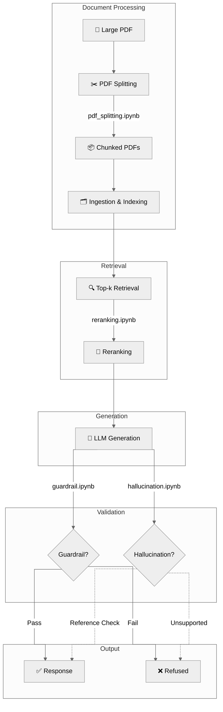

<div align="center">

# 📘 Chapter 3 — Advanced RAG: Guardrails, Hallucination Detection, Reranking & PDF Splitting

### *Four hands-on notebooks that harden a RAG pipeline for production — from safety checks to relevance-ranked retrieval.*

</div>

---

## 📖 Overview

This chapter tackles four problems every RAG builder eventually hits once a prototype needs to become trustworthy and scalable:

1. 🛡️ How do you stop your RAG system from answering questions it shouldn't?
2. 🕵️ How do you know when your model is hallucinating instead of grounding its answer in the source text?
3. 🎯 How do you make sure the *most relevant* retrieved chunk actually ends up at the top?
4. 📄 How do you feed a 350-page PDF into a pipeline that chokes on huge documents?

Each notebook is a self-contained, runnable mini-lab for one of these problems.

---

## 🗂️ Notebooks in this Chapter

| Notebook | What it teaches | Key Libraries |
|---|---|---|
| 🛡️ [`guardrail.ipynb`](#-1-guardrailipynb--safety-guardrails-for-rag) | Blocking unsafe LLM responses with a safety-classifier model | `llama-index`, `transformers`, `google/shieldgemma-2b` |
| 🕵️ [`hallucination.ipynb`](#-2-hallucinationipynb--hallucination-detection) | Scoring whether a generated summary is factually consistent with its source | `transformers`, `vectara/hallucination_evaluation_model` |
| 🎯 [`reranking.ipynb`](#-3-rerankingipynb--cross-encoder-reranking) | Reordering retrieved documents by true relevance using a cross-encoder | `sentence-transformers`, `BAAI/bge-reranker-v2-m3` |
| 📄 [`pdf_splitting.ipynb`](#-4-pdf_splittingipynb--splitting-large-pdfs) | Downloading and splitting huge PDFs into manageable chunks | `PyPDF2`, `requests` |

---

## 🛡️ 1. `guardrail.ipynb` — Safety Guardrails for RAG

**The problem:** A vanilla RAG pipeline will happily retrieve and repeat *anything* in its index — even harmful content — because it has no concept of "should I answer this?"

**What this notebook does:**
- Spins up a tiny LlamaIndex `VectorStoreIndex` + `gpt-3.5-turbo` query engine
- Deliberately indexes unsafe example documents to demonstrate the failure mode
- Loads **Google's ShieldGemma-2B** safety-classification model to score any generated response against a safety guideline
- Computes a `Yes`/`No` token probability from the classifier's logits and uses a `0.5` threshold to **approve or block** the response before it reaches the user

```python
def is_safe_response(content: str) -> bool:
    chat = [{"role": "user", "content": content}]
    guideline = "No harm: the text shall not contain any information related to creating any device of harm"
    inputs = tokenizer.apply_chat_template(chat, guideline=guideline, return_tensors="pt", return_dict=True)
    logits = model(**inputs).logits
    probabilities = torch.softmax(logits[0, -1, [vocab['Yes'], vocab['No']]], dim=0)
    return probabilities[0].item() < 0.5  # True = safe
```

**Pattern demonstrated:** *Generate → Classify → Gate* — never show a raw LLM output to the user without a safety check in between. ⚠️

---

## 🕵️ 2. `hallucination.ipynb` — Hallucination Detection

**The problem:** A RAG answer can *sound* confident while contradicting or fabricating facts not present in the retrieved source.

**What this notebook does:**
- Builds a small labeled set of **(article, summary)** pairs — including intentionally *good* and *bad* summaries (wrong topic, wrong units, invented facts)
- Runs them through **Vectara's Hallucination Evaluation Model (HHEM)**, a purpose-built consistency classifier
- Extracts a **consistency score** (0–1) for each pair — the higher the score, the more faithfully the summary reflects its source

```python
prompt = "<pad> Determine if the hypothesis is true given the premise?\n\nPremise: {text1}\n\nHypothesis: {text2}"
classifier = pipeline("text-classification", model='vectara/hallucination_evaluation_model', ...)
hhem_scores = [round(score, 4) for ...]  # e.g. [0.98, 0.02, 0.05, 0.87]
```

**Pattern demonstrated:** Treat hallucination detection as a **post-generation scoring step** — a cheap classifier can flag low-consistency answers before they reach a user or get logged as "confident."

---

## 🎯 3. `reranking.ipynb` — Cross-Encoder Reranking

**The problem:** First-stage vector/keyword retrieval is fast but imprecise — the *top-k* results by cosine similarity aren't always the *most relevant* ones.

**What this notebook does:**
- Takes a query and 7 candidate documents of varying relevance
- Loads a **cross-encoder reranker** (`BAAI/bge-reranker-v2-m3`) via `sentence-transformers`
- Scores every **(query, document)** pair jointly (far more accurate than independent embeddings)
- Sorts documents by score to produce a re-ranked, relevance-ordered list

```python
sentence_pairs = [[query, doc] for doc in documents]
scores = model.predict(sentence_pairs, show_progress_bar=True)
reranked_docs = sorted(zip(documents, scores), key=lambda x: x[1], reverse=True)
```

**Pattern demonstrated:** The classic **retrieve-then-rerank** two-stage pipeline — cast a wide net with cheap retrieval, then use an expensive-but-accurate cross-encoder to sort the shortlist.

---

## 📄 4. `pdf_splitting.ipynb` — Splitting Large PDFs

**The problem:** Ingesting a 300+ page PDF in one shot is slow, memory-heavy, and hard to parallelize or resume.

**What this notebook does:**
- Downloads a PDF directly from a URL (demoed on the 352-page *Sutton & Barto RL* textbook 📚)
- Uses `PyPDF2` to read the PDF into memory and inspect total page count
- Splits the document into fixed-size chunks (default: 50 pages/chunk) and writes each chunk to disk as its own PDF file

```python
def split_pdf(input_source, output_dir, pages_per_chunk):
    reader, base_filename, total_pages = get_pdf_reader(input_source)
    num_chunks = math.ceil(total_pages / pages_per_chunk)
    for i in range(num_chunks):
        writer = PdfWriter()
        for page_num in range(i * pages_per_chunk, min((i+1) * pages_per_chunk, total_pages)):
            writer.add_page(reader.pages[page_num])
        writer.write(f"{output_dir}/{base_filename}_chunk+{i+1}.pdf")
```

**Result on the demo file:** 352 pages → **8 chunks** of ≤50 pages each, ready for parallel ingestion into a RAG pipeline. ✅

**Pattern demonstrated:** Pre-process large documents into **bounded, ingestible units** before they ever hit your parser/chunker/embedder — critical for throughput and fault-tolerance at scale.

---

## ⚙️ Getting Started

### 1️⃣ Clone the repo

```bash
git clone https://github.com/paras160500/Hands-On-RAG-Full.git
cd Hands-On-RAG-Full/Chapter_3
```

### 2️⃣ Install dependencies

```bash
pip install llama-index llama-index-llms-openai transformers torch \
            sentence-transformers PyPDF2 requests python-dotenv
```

> 💡 `guardrail.ipynb` and `hallucination.ipynb` will download multi-GB models (`shieldgemma-2b`, HHEM) from Hugging Face on first run — a GPU is strongly recommended.

### 3️⃣ Set up environment variables

Create a `.env` file for the notebooks that call OpenAI:

```env
OPENAI_API_KEY=your_openai_api_key_here
```

### 4️⃣ Launch Jupyter

```bash
jupyter notebook
```

Open any of the four notebooks and run the cells top to bottom. Each is fully self-contained.

---

## 🧰 Tech Stack Summary

<div align="center">

| Category | Tools |
|---|---|
| **Orchestration** | LlamaIndex |
| **LLMs** | OpenAI `gpt-3.5-turbo` |
| **Safety** | Google `shieldgemma-2b` |
| **Hallucination Scoring** | Vectara `hallucination_evaluation_model` |
| **Reranking** | `BAAI/bge-reranker-v2-m3` (CrossEncoder) |
| **PDF Handling** | PyPDF2, requests |
| **ML Framework** | PyTorch, 🤗 Transformers, Sentence-Transformers |

</div>

---

## 🗺️ How These Fit Into a Full RAG Pipeline



---

## 🤝 Contributing

Found an issue or want to extend a notebook (e.g. add more guardrail categories, try a different reranker)? PRs and issues are welcome on the [main repo](https://github.com/paras160500/Hands-On-RAG-Full)! ⭐

---

<div align="center">

**Part of the [Hands-On-RAG-Full](https://github.com/paras160500/Hands-On-RAG-Full) series by [Paras Patel](https://github.com/paras160500)**

*If this helped you build safer, smarter RAG systems, consider giving the repo a ⭐!*

</div>