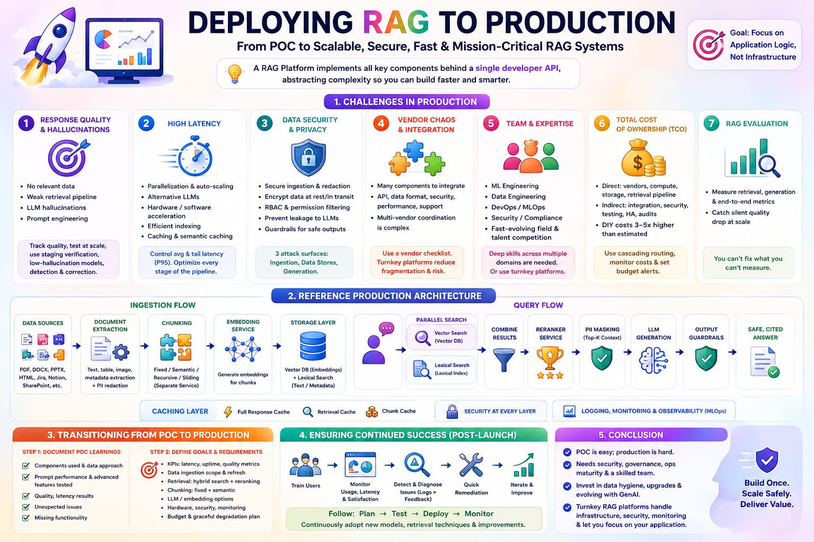
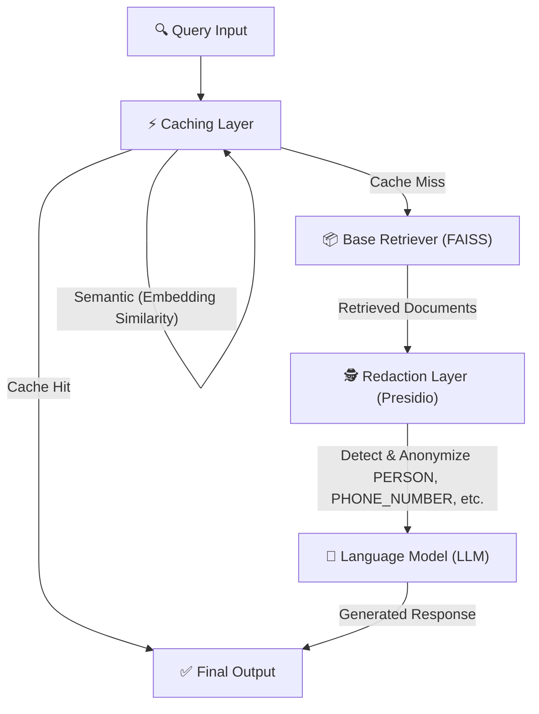

<div align="center">

# 🚀 Advanced RAG Techniques: Caching & Redaction

**Speed up your RAG pipeline with intelligent caching. Protect your users with entity-aware redaction.**



</div>

---

## 📖 Overview

This module dives into two production-critical upgrades for any RAG system:

- ⚡ **Performance** — cut latency and cost with **exact-match** and **semantic caching**
- 🔒 **Privacy** — strip sensitive PII from context and outputs with **entity-aware redaction**

Everything is delivered as hands-on, runnable **Jupyter notebooks** so you can see each technique work end-to-end.

---

## 📚 What's Inside

| Notebook | Description | Jump To |
|---|---|:---:|
| 🗄️ `caching.ipynb` | Exact-match + semantic caching to slash RAG latency | [→](#️-1-cachingipynb--optimizing-rag-with-caching) |
| 🕵️ `redaction.ipynb` | Entity-aware redaction to protect PII in RAG output | [→](#️-2-redactionipynb--entity-aware-data-privacy) |

---

## 🏗️ Architecture



> Query → cache check → (on miss) vector search → PII redaction → LLM generation → response. On a cache hit, the vector search and redaction steps are skipped entirely.

---

## 📦 Installation

### 1. Install dependencies

```bash
pip install redis langchain-openai langchain-community langchain-text-splitters \
            langchain-core pydantic presidio-analyzer presidio-anonymizer \
            python-dotenv numpy
```

### 2. Start Redis (via Docker)

```bash
docker run -d --name rag-redis -p 6379:6379 redis:latest
```

> `caching.ipynb` also includes this command inline — no need to run it separately if you're following along in the notebook.

### 3. Configure environment variables

Create a `.env` file in this folder:

```env
OPEN_AI_API=your_openai_api_key
```

---

## 🧪 How Each Notebook Works

### 🗄️ 1. `caching.ipynb` — Optimizing RAG with Caching

Two complementary caching strategies, implemented as custom LangChain `BaseRetriever` subclasses:

<table>
<tr>
<td width="50%" valign="top">

**🎯 Exact-Match Caching**

Hashes each query with SHA-256 and looks it up in Redis. Identical queries return instantly — no vector search needed.

Best for **frequently repeated** queries.

```python
class CachedRetriever(BaseRetriever):
    def _get_relevant_documents(self, query):
        query_hash = hashlib.sha256(
            query.encode("utf-8")
        ).hexdigest()

        cached = cache.get(query_hash)
        if cached:
            print("✅ Cache Hit — skipping vector search")
            return deserialize(cached)

        print("❌ Cache Miss — running vector search")
        results = self._base_retriever.invoke(query)
        cache.setex(
            query_hash, self._cache_ttl,
            json.dumps(docs_data)
        )
        return results
```

</td>
<td width="50%" valign="top">

**🧠 Semantic Caching**

Compares the new query's **embedding** against cached query embeddings via cosine similarity. Catches rephrased questions that mean the same thing.

Best for **natural, varied** phrasing.

```python
class SemanticCachedRetriever(BaseRetriever):
    def _find_similar_cached(self, query_embedding):
        # cosine similarity vs cached embeddings
        if best_similarity >= self._similarity_threshold:
            return best_match, best_query, best_similarity
        return None

    def _get_relevant_documents(self, query):
        embedding = np.array(
            self._embeddings.embed_query(query)
        )
        hit = self._find_similar_cached(embedding)
        if hit:
            print(f"✅ Semantic hit — similarity {hit[2]:.2f}")
            return hit[0]

        print("❌ Semantic miss — running vector search")
        results = self._base_retriever.invoke(query)
        # cache new query + embedding + results
        return results
```

</td>
</tr>
</table>

---

### 🕵️ 2. `redaction.ipynb` — Entity-Aware Data Privacy

Uses Microsoft's **Presidio** to detect and anonymize PII (like names and phone numbers) before it ever reaches the LLM or the end user.

```python
from presidio_analyzer import AnalyzerEngine
from presidio_anonymizer import AnonymizerEngine
from presidio_anonymizer.entities import OperatorConfig

def entity_aware_redaction(text):
    analyzer = AnalyzerEngine()
    anonymizer = AnonymizerEngine()

    results = analyzer.analyze(
        text=text,
        entities=["PERSON", "PHONE_NUMBER"],
        language="en"
    )

    anonymized = anonymizer.anonymize(
        text=text,
        analyzer_results=results,
        operators={
            "PERSON": OperatorConfig("replace", {"new_value": ""}),
            "PHONE_NUMBER": OperatorConfig("replace", {"new_value": ""}),
        }
    )
    return anonymized.text
```

**Example**

| Input | Output |
|---|---|
| `Dr. Paras called 123-456-7890` | `Dr.  called ` |

---

## 📁 Sample Data

| File | Used In | Description |
|---|---|---|
| `sample_docs.txt` | `caching.ipynb` | Sample passages on AI, ML, Deep Learning, and NLP for caching demos |

---

## ⚡ Tech Stack

| Layer | Tool |
|---|---|
| 🔗 RAG Framework | LangChain |
| 🧠 LLM & Embeddings | OpenAI (`langchain-openai`) |
| 📦 Vector Store | FAISS (`langchain-community`) |
| ⚡ Exact-Match Cache | Redis |
| 🧮 Semantic Cache | Custom, NumPy-based cosine similarity |
| 🕵️ PII Detection & Redaction | Presidio (`presidio-analyzer`, `presidio-anonymizer`) |
| ⚙️ Config | `python-dotenv` |

---

## 🧠 Key Learnings

- ⚡ **Caching is crucial for RAG performance** — both strategies cut latency and cost by avoiding redundant vector searches and LLM calls.
- 🗣️ **Semantic caching improves UX** — rephrased questions still hit the cache, keeping interactions fast and fluid.
- 🔒 **Privacy is non-negotiable** — entity-aware redaction makes RAG systems viable for sensitive or regulated data.
- 🎯 **Presidio is a flexible PII toolkit** — supports a wide range of entity types out of the box, useful for compliance-driven use cases.

---

## 🛣️ Roadmap

- [ ] Persistent semantic cache (dedicated vector DB instead of in-memory storage)
- [ ] Format-preserving / token-level redaction during generation
- [ ] Cache invalidation strategy (time-based or document-update triggered)
- [ ] Support for additional/custom PII entity types

---

## 👨‍💻 Author

Built for learning — advanced RAG techniques focused on **caching for performance** and **redaction for privacy**.

**Made by Paras Patel** · Part of [Hands-On-RAG-Full](https://github.com/paras160500/Hands-On-RAG-Full)