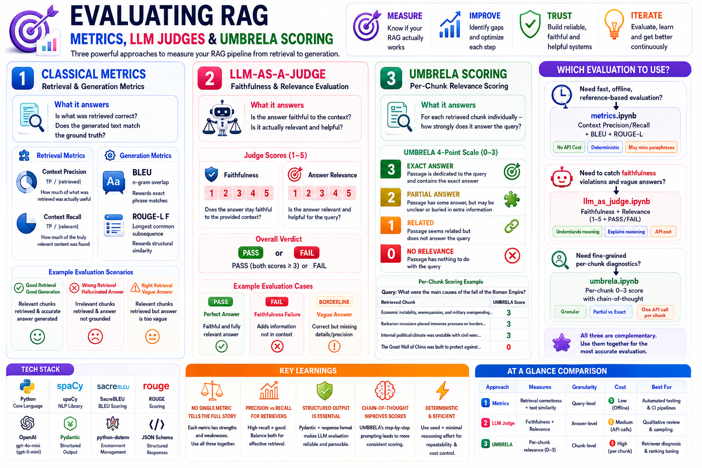

# 📊 Evaluating RAG — Metrics, LLM Judges & UMBRELA Scoring



Part of the [**Hands-On-RAG-Full**](https://github.com/paras160500/Hands-On-RAG-Full) series. Building a RAG pipeline is only half the job — **knowing whether it actually works** is the other half. This module covers the three most important evaluation approaches in modern RAG: classical retrieval + generation metrics, LLM-as-a-Judge evaluation, and UMBRELA passage-level relevance scoring.

Each approach answers a different question about your pipeline:

| Approach | Question It Answers |
|---|---|
| 📐 **Classical Metrics** | Is what was retrieved correct? Does the generated text match the ground truth? |
| 🧑‍⚖️ **LLM-as-a-Judge** | Is the answer faithful to the context? Is it actually relevant and helpful? |
| 🔬 **UMBRELA Scoring** | For each retrieved chunk individually — how strongly does it answer the query? |

---

## 🗺️ What's Inside

| Notebook | Technique | Tools |
|---|---|---|
| [`metrics.ipynb`](#1-metricsipynb--classical-retrieval--generation-metrics) | Context Precision, Context Recall, BLEU, ROUGE-L | `sacrebleu`, `rouge`, `spaCy` |
| [`llm_as_judge.ipynb`](#2-llm_as_judgeipynb--llm-as-a-judge-evaluation) | Faithfulness score, Answer Relevance score, structured reasoning | `openai` (`gpt-4o-mini`), `pydantic` |
| [`umbrela.ipynb`](#3-umbrelaipynb--umbrela-passage-relevance-scoring) | Per-chunk 0–3 relevance scoring with chain-of-thought | `openai` (`gpt-5-mini`), `pydantic` |

---

## 📦 Installation

```bash
pip install spacy sacrebleu rouge openai pydantic python-dotenv
python -m spacy download en_core_web_sm
```

### 🔑 Environment Variables

Create a `.env` file in this folder:

```env
OPEN_AI_API=your_openai_api_key
```

> `OPEN_AI_API` is required for `llm_as_judge.ipynb` and `umbrela.ipynb`. `metrics.ipynb` runs fully offline with no API key.

---

## 🧪 How Each Notebook Works

---

### 1. `metrics.ipynb` — Classical Retrieval & Generation Metrics

Implements two classical evaluation functions from scratch — no external eval framework, just pure Python + standard NLP libraries.

#### Retrieval Metrics: Context Precision & Context Recall

```python
def evaluate_retrieval(retrieved_chunk_ids, relevant_chunk_ids):
    retrieved_set = set(retrieved_chunk_ids)
    relevant_set  = set(relevant_chunk_ids)

    true_positives = len(retrieved_set.intersection(relevant_set))

    # What fraction of what was retrieved was actually relevant?
    context_precision = true_positives / len(retrieved_set)

    # What fraction of everything relevant was actually retrieved?
    context_recall    = true_positives / len(relevant_set)

    return {"context_precision": context_precision, "context_recall": context_recall}
```

| Metric | Formula | What It Measures |
|---|---|---|
| **Context Precision** | `TP / |retrieved|` | Signal-to-noise ratio — how much of what was retrieved was actually useful |
| **Context Recall** | `TP / |relevant|` | Coverage — how much of the truly relevant content was found |

> A retriever that always returns every chunk in the corpus will have perfect recall (1.0) but terrible precision (≈ 0.0). A retriever that returns one perfect chunk has perfect precision but low recall if there were many relevant chunks. Both matter.

#### Generation Metrics: BLEU & ROUGE-L

```python
def evaluate_generation(generated_answer, ground_truth_answer):
    # BLEU: n-gram overlap — rewards exact phrase matches
    bleu_score = sacrebleu.corpus_bleu([generated_answer], [[ground_truth_answer]]).score / 100.0

    # ROUGE-L: longest common subsequence — rewards structural similarity
    rouge = Rouge()
    rouge_scores = rouge.get_scores(generated_answer, ground_truth_answer)[0]

    return {
        "bleu":      bleu_score,
        "rouge-l-f": rouge_scores['rouge-l']['f']   # F-measure (precision + recall balanced)
    }
```

| Metric | What It Captures | Limitation |
|---|---|---|
| **BLEU** | Exact n-gram overlap with the reference answer | Penalises valid paraphrases; rewards verbatim copying |
| **ROUGE-L F** | Longest common subsequence — how much of the answer structure is preserved | Doesn't capture semantic similarity — "powerhouse" ≠ "energy producer" to ROUGE |

#### Evaluation Scenarios

The notebook runs three deliberately contrasting examples to expose how each metric behaves:

```python
evaluation_data = [
    # ✅ Good retrieval, good generation
    {
        "query": "What is the function of the mitochondria and where are they found?",
        "retrieved_chunks": {
            "cell_bio_01": "Mitochondria generate most of the chemical energy...",
            "cell_bio_02": "The cell nucleus contains the majority of genetic material...",  # irrelevant
            "cell_bio_03": "These organelles are found in the cytoplasm of eukaryotic cells."
        },
        "relevant_chunk_ids": ["cell_bio_01", "cell_bio_03"],
        "generated_answer":   "Mitochondria generate chemical energy and are located in the cytoplasm of eukaryotic cells.",
        "ground_truth_answer": "The primary function of mitochondria is to generate chemical energy..."
    },
    # ❌ Wrong chunks retrieved, generation forced to hallucinate
    { ... },
    # ⚠️ Correct chunks retrieved but generation is too vague
    { ... }
]
```

Each row is evaluated end-to-end and the full results dict is printed — letting you see exactly which metric catches which type of failure.

---

### 2. `llm_as_judge.ipynb` — LLM-as-a-Judge Evaluation

Where classical metrics measure *surface-level* similarity, an LLM judge measures *semantic quality* — faithfulness to the context and genuine relevance to the question. This is particularly important for paraphrased or summarised answers that BLEU/ROUGE would penalise unfairly.

#### The Judge Prompt

```python
def evaluate_with_llm_judge(query, context, generated_answer, model="gpt-4o-mini"):
    prompt = f"""
    You are an impartial judge evaluating a RAG-generated answer on two criteria:

    1. **Faithfulness** (1–5): Does the answer stay faithful to the provided context?
       It should not add information not present in the context or contradict it.

    2. **Answer Relevance** (1–5): Is the answer relevant and helpful for the given query?

    Provide scores and brief reasoning for each. Then give an **Overall Verdict**:
    PASS (both scores ≥ 3) or FAIL.

    Query:            {query}
    Context:          {context}
    Generated Answer: {generated_answer}
    """
```

#### Structured Output with Pydantic

```python
class CriterionScore(BaseModel):
    score:     int      # 1–5
    reasoning: str

class JudgeEvaluation(BaseModel):
    faithfulness:     CriterionScore
    answer_relevance: CriterionScore
    overall_verdict:  str            # "PASS" or "FAIL"
```

The judge returns structured JSON (enforced by `response_format=JudgeEvaluation`) so scores and reasoning are always machine-parseable — no brittle regex needed.

#### Evaluation Examples

Three examples are run, covering the full range of outcomes:

```python
evaluation_data = [
    # ✅ Perfect: answer stays in context and is fully relevant
    {
        "query":            "What is the primary function of mitochondria?",
        "context":          "Mitochondria generate ATP, used as a source of chemical energy.",
        "generated_answer": "The primary function of mitochondria is to act as the powerhouse, producing ATP."
    },
    # ❌ Faithfulness failure: answer mentions Buzz Aldrin — context only supports Neil Armstrong
    {
        "query":            "Who was the first person to walk on the moon?",
        "context":          "The first person to step onto the lunar surface was Neil Armstrong.",
        "generated_answer": "Neil Armstrong and Buzz Aldrin were the first people to walk on the moon."
    },
    # ⚠️ Borderline: correct but vague — "Water boils at 100 degrees" (missing unit/pressure context)
    {
        "query":            "What is the boiling point of water?",
        "context":          "At standard atmospheric pressure, water boils at 100° Celsius (212° Fahrenheit).",
        "generated_answer": "Water boils at 100 degrees."
    }
]
```

The judge output for each includes both scores, both reasoning strings, and the overall PASS/FAIL — making it immediately clear *why* an answer failed.

---

### 3. `umbrela.ipynb` — UMBRELA Passage Relevance Scoring

UMBRELA (Useful Meaning Beyond REtrieval for Language Assessment) is a **per-chunk, fine-grained relevance scorer**. Rather than binary relevant/not-relevant, it uses a 4-point scale that captures the *degree* to which each retrieved passage answers the query — more useful for diagnosing retriever quality and tuning ranking.

#### The 4-Point UMBRELA Scale

| Score | Label | Meaning |
|---|---|---|
| `0` | **No Relevance** | The passage has nothing to do with the query |
| `1` | **Related** | The passage seems topically related but doesn't answer the query |
| `2` | **Partial Answer** | The passage has some answer but it's unclear or buried in extra info |
| `3` | **Exact Answer** | The passage is dedicated to the query and contains the exact answer |

#### The UMBRELA Prompt (Chain-of-Thought)

```python
UMBRELA_PROMPT = """
Given a query and a passage, provide a score on an integer scale of 0 to 3:
    0 = passage has nothing to do with the query
    1 = passage seems related but does not answer it
    2 = passage has some answer, but may be unclear or buried in extra information
    3 = passage is dedicated to the query and contains the exact answer

Split this problem into steps:
  - Consider the underlying intent of the search.
  - Measure how well the content matches a likely intent of the query (M).
  - Measure how trustworthy the passage is (T).
  - Consider the above aspects and decide on a final score.

Query:   {query}
Passage: {chunk}
"""
```

The step-by-step instruction is intentional — it forces the model to reason before scoring rather than guessing, improving consistency.

#### Structured Output

```python
class UMBRELAScoreValues(str, Enum):
    NO_RELEVANCE    = "0"
    RELATED         = "1"
    PARTIAL_ANSWER  = "2"
    EXACT_ANSWER    = "3"

class UMBRELAScore(BaseModel):
    score: UMBRELAScoreValues
```

`gpt-5-mini` is called with `seed=42` and `reasoning_effort="minimal"` for determinism and efficiency.

#### Implementation

```python
def compute_umbrela(query: str, chunks: list) -> dict[str, int]:
    scores = {}
    for chunk in chunks:
        prompt = UMBRELA_PROMPT.format(query=query, chunk=chunk)
        completion = client.beta.chat.completions.parse(
            model="gpt-5-mini",
            messages=[...],
            response_format=UMBRELAScore,
            seed=42,
            reasoning_effort="minimal"
        )
        scores[chunk] = int(completion.choices[0].message.parsed.score)
    return scores
```

#### Evaluation Examples

**Example 1 — Multi-cause history question:**
```python
query1  = "What were the main causes of the fall of the Roman Empire?"
chunks1 = [
    "Economic instability, overexpansion, and military overspending strained the treasury.",  # → Score 3
    "Barbarian invasions placed immense pressure on Roman borders...",                         # → Score 3
    "Internal political climate was unstable with civil wars...",                              # → Score 3
    "The Great Wall of China was built to protect against nomadic invasions..."                # → Score 0
]
```

**Example 2 — Scientific mechanism question:**
```python
query2  = "How does photosynthesis work in plants?"
chunks2 = [
    "Photosynthesis converts light, CO₂, and water into glucose and oxygen.",  # → Score 3
    "Chlorophyll in chloroplasts absorbs sunlight for photosynthesis.",         # → Score 2
    "Mitochondria are the powerhouses of the cell...",                          # → Score 0
]
```

The UMBRELA output makes retrieval quality immediately readable — a retriever returning three `Score 3` chunks and one `Score 0` is clearly better calibrated than one returning four `Score 1` chunks.

---

## 🧠 Choosing the Right Evaluation Approach

```
Need fast, offline, reference-based evaluation?
    └── metrics.ipynb (Context Precision/Recall + BLEU + ROUGE-L)
         ✅ No API cost  ✅ Deterministic  ⚠️ Misses paraphrases

Need to catch faithfulness violations and vague answers?
    └── llm_as_judge.ipynb (Faithfulness + Relevance, 1–5 + PASS/FAIL)
         ✅ Understands meaning  ✅ Explains reasoning  ⚠️ API cost per call

Need fine-grained per-chunk retriever diagnostics?
    └── umbrela.ipynb (Per-chunk 0–3 score with chain-of-thought)
         ✅ Granular  ✅ Identifies partial vs. exact matches  ⚠️ One API call per chunk
```

In practice, all three are **complementary** — use classical metrics for a quick automated sanity check in CI, LLM-as-a-Judge for sampled qualitative review, and UMBRELA when diagnosing and improving your retriever specifically.

---

## ⚡ Tech Stack

| Layer | Tool |
|---|---|
| Classical retrieval metrics | Pure Python (set intersection) |
| BLEU scoring | `sacrebleu` (SacreBLEU — standardised, reproducible) |
| ROUGE-L scoring | `rouge` |
| Sentence segmentation | `spaCy` (`en_core_web_sm`) |
| LLM judge | OpenAI `gpt-4o-mini` |
| UMBRELA scorer | OpenAI `gpt-5-mini` (`seed=42`, `reasoning_effort="minimal"`) |
| Structured output | `pydantic` (`BaseModel`, `Enum`) + `client.beta.chat.completions.parse` |
| Env management | `python-dotenv` |

---

## 🔑 Key Learnings

- **No single metric tells the full story.** BLEU/ROUGE penalise perfectly valid paraphrases; LLM judges can be inconsistent at the margins; UMBRELA is expensive per-chunk. The three approaches are designed to be used together.
- **Context Precision and Context Recall are the retriever's own BLEU/ROUGE** — they quantify whether the retriever is noisy (low precision) or incomplete (low recall), independently of the generator's quality.
- **Structured output (`response_format` + Pydantic) is essential for LLM evaluation** — if the judge returns free text, score extraction breaks on every edge case. Enforcing a schema makes the pipeline reliable.
- **UMBRELA's chain-of-thought prompt** (consider intent → measure match → measure trust → decide) produces more consistent scores than a one-line "rate this 0–3" prompt, because it forces the model to reason before committing to a number.
- **`seed` and `reasoning_effort="minimal"`** in the UMBRELA implementation are deliberate choices for evaluation repeatability and cost control — evaluation pipelines that run frequently need to be both deterministic and cheap.

---

## 🚀 Future Improvements

- Combine all three evaluators into a single `evaluate_rag_pipeline()` function that returns a unified report per query
- Add **Answer Correctness** (semantic similarity between generated and ground-truth answer using embeddings) alongside BLEU/ROUGE
- Run the LLM judge at scale with `asyncio` batch calls to reduce evaluation latency
- Add a scoring dashboard (e.g. a simple `pandas` DataFrame + `matplotlib` bar chart) to visualise metric distributions across a test set

---

## 👨‍💻 Author

Built for learning: RAG evaluation — classical metrics, LLM-as-a-Judge, and UMBRELA scoring
By Paras Patel.